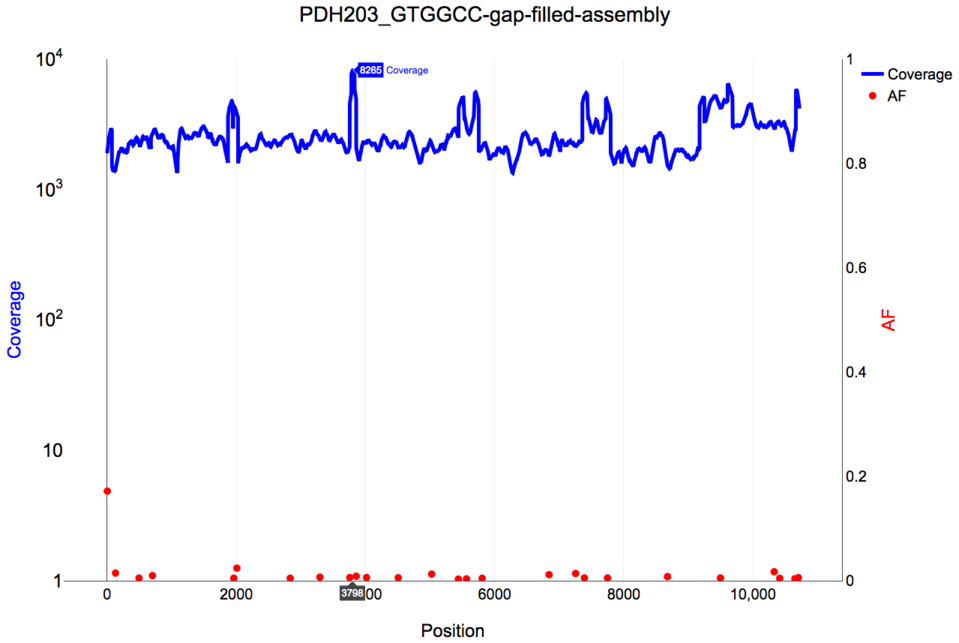

# nf-core/vipr

This document describes the output produced by the pipeline. Results
will appear in the directory specified with the `--outdir` parameter
(default: `results`). Each sample has its own subdirectory. The
structure of a sample subdirectory is described in the following.

## Read Data

Reads are preprocessed, i.e. quality trimmed (and combined in case of
multiple read pairs) as well as decontaminated. All respective data is
stored in the `reads/` sub-directory

- `reads/{sample}_R[12]-trimmed.fastq.gz`: quality trimmed (and combined) reads
- `reads/{sample}_trimmed_decont_[12].fastq.gz`: decontaminated
  trimmed reads
- `reads/{sample}_trimmed_decont_[12]_fastqc.*`: fastqc data for the
  above

## Assembly

Preprocessed reads are assembled into contig and then orientated and
glued together using the user-specified reference. As a final step the
assembly is polished through iterative mapping, consensus calling and
variant integration

- `{sample}_contigs.fa`: Tadpole contigs
- `{sample}-gap-filled-assembly.fa`: Orientated contigs, gaps filled
  with reference
- `{sample}-gap-filled-assembly.gaps.bed`: reference gap positions
- `{sample}_polished_assembly.fa`: Assembly polished through iterative
  mapping, consensus calling and variant integration
- `{sample}_0cov2N.fa`: submission-ready reference with zero coverage
  positions masked

## Mapping and variant calling

- `{sample}_kraken.report.txt`: Kraken report
- `{sample}.cov.gz`: Coverage per position
- `{sample}.bam`: Preprocessed reads mapped against polished assembly
- `{sample}.bam.bai`: BAM index
- `{sample}.bam.stats`: Stats for BAM file
- `{sample}.vcf.gz`: LoFreq variant calls for BAM file
- `{sample}_af-vs-cov.html`: Interactive plot of variant AF vs coverage

A screenshot of the interative plot follows: 

